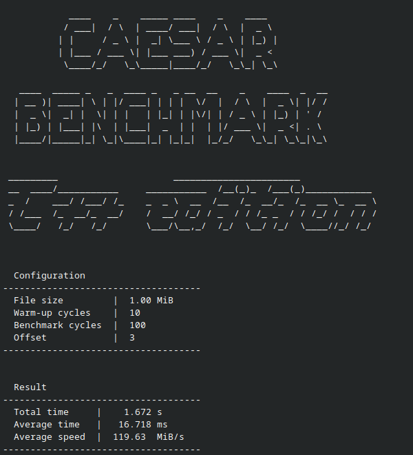

# caesar-cpp

C++ implementation for [Caesar Benchmark](https://github.com/01eksa/caesar-benchmark)



**Caesar Benchmark** is a lightweight CPU performance benchmark based on the classic Caesar cipher.

It uses a deliberately straightforward implementation: index shifting and alphabet-based substitution. Lowercase and
uppercase letters are handled separately, while non-alphabetic characters are left unchanged. This creates a pure
low-level workload consisting of linear memory access, arithmetic operations, and conditional branches.

**This is intentional.** Suggestions to replace the math with lookup tables or other optimizations will be rejected. The
goal is to stress-test the CPU and compiler on this specific pipeline, not to find the fastest possible Caesar cipher.

*Note: This is a synthetic mini-benchmark, not a comprehensive test suite. For full system evaluation, use professional
tools like Geekbench.*

Pre-built binaries (compiled with LLVM Clang) are available in the **Releases** tab. They offer excellent out-of-the-box
performance across platforms. Build instructions are below if you want to test different compilers or maximum
optimization for your CPU.

## Build:

Standard (portable):
```bash
cmake -B build -DCMAKE_BUILD_TYPE=Release
cmake --build build --config Release
```
Maximum performance (native optimization):
```bash
cmake -B build -DCMAKE_BUILD_TYPE=Release -DCMAKE_CXX_FLAGS="-march=native -O3 -flto"
cmake --build build --config Release
```

## Run:

```bash
./caesar-cpp [OPTIONS] file_path        # Linux / macOS
caesar-cpp.exe [OPTIONS] file_path      # Windows
```

### Positionals:

* `file_path` (TEXT:FILE, REQUIRED) — Path to the file used in the benchmark.

### Options:

* `-h, --help` — Print this help message and exit.
* `-w, --warmup UINT [10]` — Warm-up cycles (to populate CPU cache before measurements).
* `-r, --repeat UINT [100]` — Benchmark execution cycles.
* `-o, --offset UINT [3]` — Offset value (key) for the Caesar cipher.

## Test Data (Recommended)

Every GitHub Release includes the `1MiB.txt` sample file.

It is highly recommended to use this file for testing to ensure consistent and reproducible results:

**Linux / macOS:**

```bash
./caesar-cpp 1MiB.txt
```

**Windows:**

```bash
caesar-cpp.exe 1MiB.txt
```
